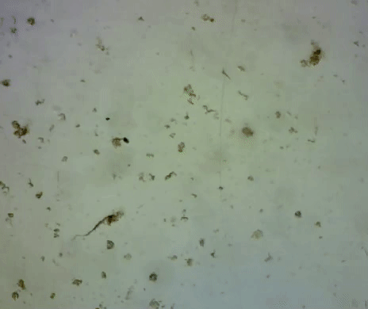

# Tracking Protozoa
Interested in computer vision and inspired by an article on [using protozoa swimming patterns to detect toxins in water](https://www.whoi.edu/mr/pr/viewArticle.do?id=133689), I developed a basic program that tracks movement in protozoa, rotifers, and other microscopic organisms. The program implements two possible ways of tracking movement: background subtraction and Lucas-Kanade/Feature detection.

Both methods capture the position (X, Y) of the points (retrieved from the moving organisms) which can be used as a basis for measuring interaction and correlation of variables. The program, while limited, provides a platform to further identify swimming patterns of selected organisms in 2D and 3D space.

## Methods
The two different methods that I implemented in tracking protozoa that are built into the application.

1. Background subtraction

2. Lucas-Kanade and Feature Detection

### Background Subtraction

An initial frame is captured from the device and is set as the background, which is then blurred using Gaussian blur. As frames are read by the capture device, each frame is blurred and then a threshold is created which tracks the differences between the initial frame and the current frame. Changes are highlighted with a pink bounding box, and the movement is tracked.

### Feature Detection and Lucas-Kanade

A user defines a region of interest, in this case a protozoa or other microscopic organisms, where using feature detection gives an array of points that highlights the object. The points are averaged out which returns a single, averaged point used for tracking. The points are average due to the feature detection returning points selecting the outline of the protozoa. To get a more accurate tracking path, the points are averaged and the returned point is usually always in the center of the organism.
